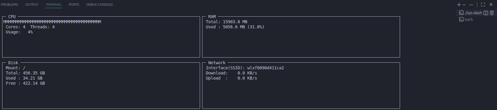

Pro System Dash (C / ncurses)

Pro System Dash is a full-scale, real-time Linux system monitor written entirely in C, designed for performance, accuracy, and terminal-native visualization.

Unlike most modern system monitors that rely on heavy frameworks or abstraction layers, this project talks directly to the Linux kernel by parsing /proc files and using standard system calls.

Why This Exists

Most system monitors fall into one of two categories:

Too simple — toy-like displays with little real insight

Too bloated — excessive dependencies, high overhead, and abstraction noise

This project was built with a clear philosophy:

Fast — written in pure C with minimal runtime overhead

Direct — manually parses kernel data from /proc

Visual — renders real-time graphs using a custom ncurses engine

Terminal-first — no GUI, no X11/Wayland dependency

Features
CPU Monitoring

Real-time CPU usage using the delta method

Parses /proc/stat snapshots

Displays:

CPU model

Core count

Thread count

Live usage percentage

Memory Monitoring

Live RAM usage tracking

Reads from /proc/meminfo

Displays Total vs Available memory

Disk Monitoring

Deep inspection of the root filesystem

Uses statvfs() for accurate storage statistics

Network Monitoring

Automatically detects active network interfaces

Supports both wired and wireless interfaces

Reads /proc/net/dev

Calculates live upload/download speed (KB/s)

Displays SSID for wireless interfaces (when available)

Live Graphs

Vertical text-based sparklines

Uses Unicode block characters:

█ ▆ ▄

Rolling history buffer for smooth real-time updates

Prerequisites

You need ncurses development headers and standard build tools.

Ubuntu / Debian
sudo apt update
sudo apt install libncurses5-dev libncursesw5-dev build-essential

Build & Execution
1. Compile
gcc dashboard.c -o sys-dash -lncurses -lm

2. Make Executable
chmod +x sys-dash

3. Run
./sys-dash

Note:
For best layout and graph clarity, use a terminal size of at least 100×30.

Technical Details
CPU Usage — The Delta Method

Linux does not provide a direct CPU usage percentage.
This tool calculates usage by:

Reading /proc/stat

Sleeping for exactly 1 second

Reading /proc/stat again

Computing:

(work_delta / total_delta) * 100

This approach ensures accurate, real-time CPU usage.

UI Rendering

Built using ncurses sub-windows

Prevents screen flicker during rapid refresh cycles

Efficient redraw strategy for stable visuals

Memory & Performance

Uses raw pointers (no dynamic containers)

Graph history stored in a rolling 40-integer array

Total memory footprint stays under 2MB

Designed for long-running sessions

Philosophy

No heavy libraries

No unnecessary abstraction

No background services

Just C, ncurses, and the Linux kernel